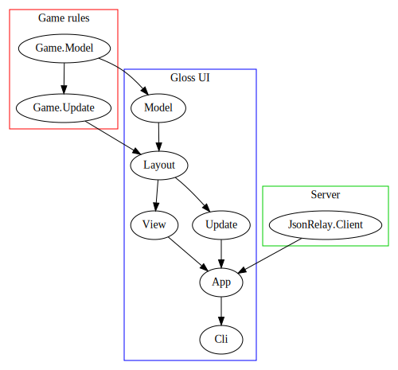
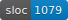
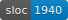
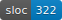

# *Hermetic*

A two player, simultaneous turn desktop strategy game.

<image alt="screenshot" src="./misc/screenshot.png" width="800">

# Install

See [docs/install.md](./docs/install.md).

# Player guide

[Start here](http://ianjeffries.net/id/9627/hermetic-0.0/Game-Model.html#t:Base).

# Haddocks

[Hosted here](http://ianjeffries.net/id/9627/hermetic-0.0/index.html).

# Design

Core module layout:



## Components

### Game rules



Located at [./src/Game](./src/Game). Completely UI-agnostic, could be broken into its own separate package if we wanted. Imports nothing local outside of `Game.*`.

### Gloss UI



Everything in [./src](./src) outside of `./src/Game/*`.

Tracks local state like what base the user has selected. Uses the server to exchange orders with the opponent. When both players have moved uses the game rules to step the game forward.

### Server



A local package located at [./json-relay](./json-relay). Provides an executable server which allows clients to join rooms and relays JSON messages between clients in the same room. Knows nothing about this specific game.

## MVU

The UI uses a Model/View/Update architecture. The game rules also have a Model and Update, but no View.

This can be summarized with a few type signatures.

Game rules:
```hs
data Model = Model
  { modelPlaces :: HashMap PlaceId Place
  ...
  }

Game.Model.Update.update :: HashMap Player Orders -> Game.Model.Model -> Game.Model.Model
```

Gloss UI:
```hs
data Model = Model
  { modelGame      :: Game.Model.Model
  , modelSelection :: Selection
  ...
  }

View.view :: Model -> Picture

Update.update :: Input -> Model -> Model
```

In Gloss unlike Elm there's no `Msg` type. That leaves it up to us to figure out how to get the View and Update agreeing on where clickable things are displayed without drowning in duplicate code.

Our solution is the [Layout](./src/Layout.hs) module, which provides a description of where each clickable item is in the UI:

```hs
newtype Layout item
  = Layout { unLayout :: [Set item] }

uiLayout :: Model -> Layout Item
```

This is used by the View to render the UI and by Update to process clicks.

## NIH

Having many features or graphics isn't a goal of the game. So we can use simple tools and implement the rest of what we need ourselves.

We use [Gloss](http://hackage.haskell.org/package/gloss) which provides a keyboard/mouse [input type](http://hackage.haskell.org/package/gloss/docs/Graphics-Gloss-Interface-IO-Game.html#t:Event), an image [output type](http://hackage.haskell.org/package/gloss/docs/Graphics-Gloss-Data-Picture.html#t:Picture), and a MVU [app runner](http://hackage.haskell.org/package/gloss/docs/Graphics-Gloss-Interface-IO-Game.html#v:playIO). Since we implement everything else the code provides examples of panning, zooming, and mapping mouse clicks to UI items.

## Multiplayer

Multiplayer is synchronous.

Each player has a [Game.Model](./src/Game/Model.hs). When both players have ended their turns, each calls [Game.Update.update](./src/Game/Update.hs) with the same inputs (both their and their opponent's orders). This rolls the game model forward to the start of the next turn.

This means `Game.Update.update` must be deterministic. We avoid functions like `Data.HashMap.Strict.toList` in the game code.

Each player also has a UI model: [Model](./src/Model.hs). These will have different values for each player.

There's no attempt to make the game resistant to bad actors. If someone wants to cheat they can modify their client to view board info that should be hidden.

# Why no PRs?

I'd like absolutely no maintenance burden from this, not even the almost none that comes from quality PRs.

Fork and add your own twist!

# Special thanks

+ Mitchell Rosen: for getting multiplayer working in *The Depths*, an earlier game this multiplayer implementation is based off of.

+ Gib Jeffries: for map development in Onshape and playtesting.
