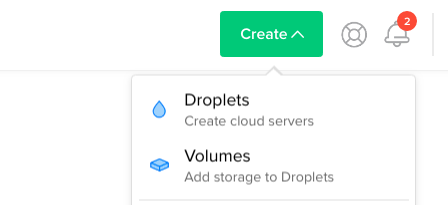
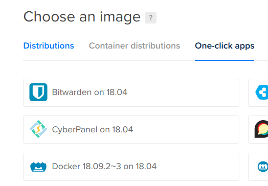

# Summary

A server with rooms.

Just a quick-and-dirty project, but you may be interested in the deployment notes below.

# Deployment

## Goals

+ Run the `json-relay` executable in the cloud with as little work as possible.

+ Build it locally because I don't want to pay for a server with enough RAM to compile it.

+ Avoid any linker issues

## Solution

Stack + Docker + Digital Ocean (or any hosting provider that supports Docker).

Use `scp` to get the Docker container to Digital Ocean, this lets us avoid Docker Hub.

## Setup

### Digital Ocean

Create a Droplet via "Create > Droplets":



 And then "One-click apps > Docker":



### Stack

Add the following to `stack.yaml`:

```yaml
image:
  containers:
    - base: "fpco/pid1"
```

## Deploy

Make a container:

```sh
stack image container
docker save json-relay > /tmp/json-relay.tar
```

This uses `./docker-compose.yaml`, which in turn uses [this](https://hub.docker.com/r/fpco/pid1/) Docker image.

Next copy it to the server, replacing `ianjeffries` with your Docker username:

```
scp ./docker-compose.yaml root@relay.ianjeffries.net:/root
scp /tmp/json-relay.tar root@relay.ianjeffries.net:/root
```

Verify what that created (optional):

```sh
docker-images
docker-compose up
```

Complete deployment:

```sh
ssh root@relay.ianjeffries.net
cat json-relay.tar | docker load
docker-compose up --detach
```

## Misc

(Run these from the server)

View logs:

```sh
docker logs json-relay-container
```

Stop the server:

```sh
docker stop json-relay-container
```

SSH into the container:

```sh
docker exec --interactive --tty json-relay-container /bin/bash
```
